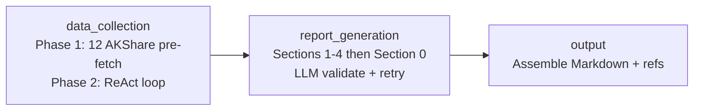

# A-Share Analyst

基于 LLM 的 A 股季度财报自动点评工具。输入公司名与报告期，自动采集财务数据并生成专业研报。

## 功能特性

- **全自动数据采集** — 通过 AKShare 调用 28 个金融数据接口，覆盖利润表、资产负债表、现金流量表、财务指标、同行对比、盈利预测等
- **ReAct 智能补全** — Phase 2 ReAct 循环让 LLM 自主决定补充哪些数据，最多 30 轮工具调用
- **专业研报生成** — 5 章结构：业绩与经营情况、发展展望与投资逻辑、盈利预测与估值、风险提示、综述摘要
- **数据溯源引用** — 每段分析均附带 `DATA_REFS` 引用标注，可追溯至具体数据源
- **文件缓存** — 三级 TTL 缓存（7 天/1 天/1 小时），避免重复 API 调用
- **灵活 LLM 配置** — 支持 OpenAI 兼容接口，可切换任意模型

## 快速开始

### 1. 安装依赖

```bash
git clone https://github.com/DreamWalkerXZ/a-share-analyst.git
cd a-share-analyst
uv sync
```

### 2. 配置环境变量

```bash
cp .env.example .env
```

编辑 `.env`，填入必需的 API Key：

| 变量 | 说明 |
|------|------|
| `OPENAI_API_KEY` | LLM API Key（必需） |
| `SERPER_API_KEY` | Serper 搜索 API Key（必需） |
| `OPENAI_BASE_URL` | API 地址，默认 `https://api.openai.com/v1` |
| `OPENAI_MODEL` | 模型名称，默认 `gpt-4o` |

可选配置 LangSmith 追踪，参见 `.env.example`。

### 3. 生成研报

```bash
# 使用公司名称
uv run main.py "贵州茅台 2025 Q4"

# 使用股票代码
uv run main.py "600519 2025 Q4"
```

报告输出至 `output/` 目录，格式示例：

```
output/贵州茅台_2025Q4_20260426_231909.md
```

## 使用方法

### 输入格式

```
uv run main.py "<公司名或股票代码> <年份> <季度>"
```

季度支持 `Q1`、`Q2`、`Q3`、`Q4`。

### 禁用缓存

强制重新采集数据，不使用本地缓存：

```bash
DISABLE_DATA_CACHE=1 uv run main.py "贵州茅台 2025 Q4"
```

## 项目架构



数据采集阶段使用 LangGraph 编排，Phase 2 中 LLM 在三个工具间自主调度：

| 工具 | 功能 |
|------|------|
| `StructuredDataTool` | 调用 AKShare 金融数据接口 |
| `RealTimeSearchTool` | 通过 Serper 搜索行业资讯与分析师观点 |
| `FinancialCalculatorTool` | 沙箱化财务计算（simpleeval） |

## 开发

### 运行测试

```bash
uv run pytest
```

### 项目结构

```
src/
├── agent/          # LangGraph 工作流（graph, nodes, subgraph, state）
├── prompts/        # LLM 提示词（数据采集、报告章节）
├── tools/          # 工具封装（AKShare, Serper 搜索, 计算器）
└── utils/          # 工具函数（LLM 工厂, 缓存, 数据格式化）
```

## 技术栈

- Python 3.11+
- [LangGraph](https://github.com/langchain-ai/langgraph) — 工作流编排
- [LangChain](https://github.com/langchain-ai/langchain) + langchain-openai — LLM 调用
- [AKShare](https://github.com/akfamily/akshare) — A 股金融数据
- [simpleeval](https://github.com/danthedeckie/simpleeval) — 安全表达式求值
